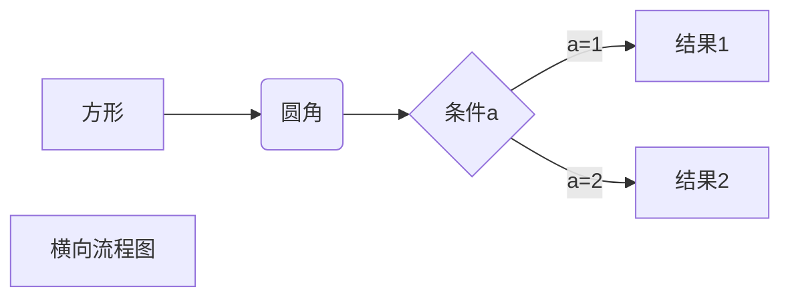

* TOC
{:toc}

这是一个测试

# 1、这是一个一级标题

## 这是第一个二级标题

部分正文，这里是正文

### 三级标题测试

## 这是第二个二级标题

下面是程序显示的测试：

~~~c++
#include <iosrteam>
using namespace std;
int main(){
    cout<<"hello world!";
}
~~~

# 2、这是第二个一级标题

此处为公式块：
$$
f=sin(x/y)
$$
此处创建一个表格：

| 1    | 2    | 3    |
| ---- | ---- | ---- |
| 1    | 1    | 1    |
| 2    | 2    | 2    |
| 3    | 3    | 3    |

此处是一个流程图：
（复制于[菜鸟教程笔记](https://www.runoob.com/markdown/md-advance.html) ）

同时测试一下链接QWQ

